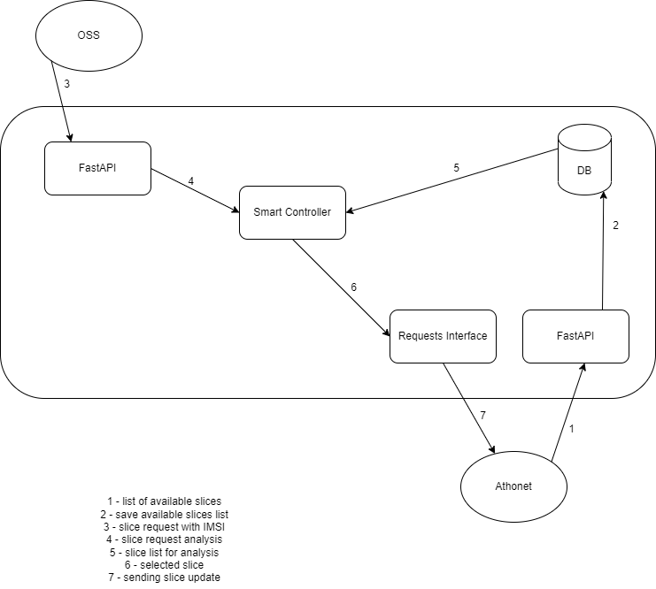

# "NFVCL Athonet Interface" (NAI)
The "NFVCL Athonet Interface" (NAI) is the south-bound component to allow NFVCL to interact with Athonet 5G core subsystem (named "greek exFa" in the "5G-Induce" project, [5G-Induce project](https://www.5g-induce.eu/)) .

## NFVCL
The NFVCL is a network-oriented meta-orchestrator, specifically designed for zeroOps and continuous automation. 
It can create, deploy and manage the lifecycle of different network ecosystems by consistently coordinating multiple 
artefacts at any programmability levels (from physical devices to cloud-native microservices).
A more detailed description of the NFVCL will be added to the [Wiki](https://nfvcl-ng.readthedocs.io/en/latest/index.html).

## How does it work
At the booting time the Athonet 5G Core subsystem sends the list of the existing slices to the NFVCL (1).
The NAI receives the messages and save the information on the internal DB (2), updating the existing if needed.
After that, everytime, the OSS can requests a slice-intent (3).
The NFVCL interface anylises the slice (4) to look for, if exists, a compatible pre-allocated slice, using the data on the DB (5).
If found (6), the NFVCL sends a message to Athonet to ask for an attachment operation (7): enable a specific IMSI list to use the slice resources.



## Getting started
After download the code, follow the steps below:
- Configure "athonethost.txt" and "imsilist.txt":
  - "athonethost.txt": IP address and port of the Athonet 5G core interface
    ``` bash
    # athonethost.txt
    127.0.0.1
    8080
  ```
  - "imsilist.txt": the list of the IMSI of the devices to be attached and deattached to/from the requested slice
    ``` bash
    # imsilist.txt
    001010000000001
    001010000000002
    001010000000003
    ```
- Execute the "setup.sh" script. It download and install all the software needed for the execution of the "NFVCL Athonet Interface".
  ``` bash
  ./setup.sh
  ```
- Lauch "run.sh". This script creates two screens where the code will be in execution.
  ``` bash
  ./run.sh
  ```


## Authors
**Guerino Lamanna**

- GitHub: [@guerol](https://github.com/guerol)

## Mantenairs
**Guerino Lamanna**

- GitHub: [@guerol](https://github.com/guerol)

## Contributing

Contributions, issues, and feature requests are welcome!

## 📝 License

This project is [GPL3](./LICENSE) licensed.
